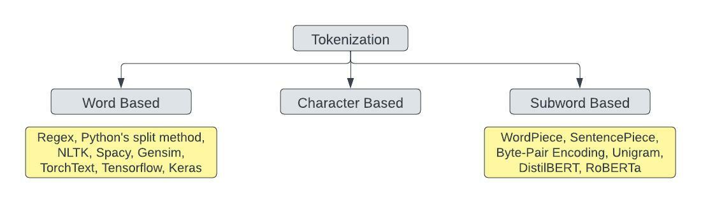

# Tokenization

Tokenization is one of the first steps in NLP pipeline. It is a technique to split a sentence, phrase, paragraph or an entire document to smaller units. These smaller units are called tokens. Tokens must not always be words. It can be anything — a word, a subword, or a character.

     

As illustrated in the figure above, tokenization is primarily categorised to three different groups.
A `word-based` tokenization algorithm will break a text into words based on a delimiter. This technique leads to massive vocabulary size and large number of out of vocabulary (OOV) tokens which then leads to heavier model and loss of information as the model will not learn anything about the OOV words. `Character-based` tokenizers split the raw text into individual characters. This results in a very small vocabulary and no or very few OOV tokens. The space and time complexity is reduced. Yet this technique is not considered the best because it results in very long sequences and a character does not carry useful meaning unlike a word that does. A solution between these two techniques is `subword-based` tokenization. The subword splitting will help the model learn that the words with the same root word (“tokens” and “tokenizing” with root word "token") are similar in meaning. Subword-based tokenization algorithms uses the following principles:

- Do not split the frequently used words into smaller subwords.
- Split the rare words into smaller meaningful subwords.

## Why Tokenization?

Tokenization helps splitting of unstructured data or text into chunks of information. These chunks represent the discrete elements whose occurrences in a corpus document can be represented as a vector of the corresponding document. This way the unstructured data can be represented as a numerical data structure which can be fed directly to machine learning algorithm.

## Methods Included

- [x] [NLTK Tokenizers](https://github.com/arunism/NLP-Fundamentals/blob/master/Tokenization/01-NLTK.ipynb)
- [x] [Spacy Tokenizer](https://github.com/arunism/NLP-Fundamentals/blob/master/Tokenization/02-Spacy.ipynb)
- [x] [TextBlob Tokenizer](https://github.com/arunism/NLP-Fundamentals/blob/master/Tokenization/03-TextBlob.ipynb)
- [x] [TorchText Tokenizer](https://github.com/arunism/NLP-Fundamentals/blob/master/Tokenization/04-TorchText.ipynb)
- [x] [TensorFlow Tokenizer](https://github.com/arunism/NLP-Fundamentals/blob/master/Tokenization/05-Tensorflow.ipynb)
- [x] [Gensim Tokenizer](https://github.com/arunism/NLP-Fundamentals/blob/master/Tokenization/06-Gensim.ipynb)
- [x] [Byte-Pair Encoding](https://github.com/arunism/NLP-Fundamentals/blob/master/Tokenization/07-BPE.ipynb)
- [x] [WordPiece Tokenization](https://github.com/arunism/NLP-Fundamentals/blob/master/Tokenization/08-WordPiece.ipynb)
- [x] [Unigram Tokenization](https://github.com/arunism/NLP-Fundamentals/blob/master/Tokenization/09-Unigram.ipynb)

## References

1. [Tokenization doesn't have to be slow !](https://notebook.community/huggingface/pytorch-transformers/notebooks/01-training-tokenizers)
2. [A Deep Dive into the Wonderful World of Preprocessing in NLP](https://gist.github.com/atinsood/6d185dfe025cbb5d55f158d4d17bc142)
3. [NLTK Tokenizer Package Documentation](https://www.nltk.org/api/nltk.tokenize.html)
4. [NLTK Tokenize – Complete Tutorial for Beginners](https://machinelearningknowledge.ai/nltk-tokenizer-tutorial-with-word_tokenize-sent_tokenize-whitespacetokenizer-wordpuncttokenizer/)
5. [Python for Data Science and Machine Learning Bootcamp](https://www.udemy.com/course/python-for-data-science-and-machine-learning-bootcamp/)
6. [Spacy Tokenization Documentation](https://spacy.io/usage/linguistic-features#tokenization)
7. [Complete Guide to Spacy Tokenizer with Examples](https://machinelearningknowledge.ai/complete-guide-to-spacy-tokenizer-with-examples/)
8. [TorchText Tokenizer Documentation](https://pytorch.org/text/stable/data_utils.html)
9. [Tokenizing with TF Text](https://www.tensorflow.org/text/guide/tokenizers)
10. [What does Keras Tokenizer method exactly do?](https://stackoverflow.com/questions/51956000/what-does-keras-tokenizer-method-exactly-do)
11. [Guide to Subword Tokenizers by Tensorflow](https://www.tensorflow.org/text/guide/subwords_tokenizer)
12. [Word, Subword, and Character-Based Tokenization: Know the Difference](https://towardsdatascience.com/word-subword-and-character-based-tokenization-know-the-difference-ea0976b64e17)
13. [Google Sentencepiece : Unsupervised Text Tokenizer](https://github.com/google/sentencepiece)
14. [A New Algorithm for Data Compression](https://www.derczynski.com/papers/archive/BPE_Gage.pdf)
15. [Byte-Pair Encoding Tokenization](https://huggingface.co/course/chapter6/5)
16. [Byte-Pair Encoding Algorithm](https://leimao.github.io/blog/Byte-Pair-Encoding/)
17. [Tokenizers: How Machines Read](https://blog.floydhub.com/tokenization-nlp/)
18. [WordPiece Tokenization](https://huggingface.co/course/chapter6/6)
19. [A Fast WordPiece Tokenization System](https://ai.googleblog.com/2021/12/a-fast-wordpiece-tokenization-system.html)
20. [Google's Neural Machine Translation System: Bridging the Gap between Human and Machine Translation](https://arxiv.org/abs/1609.08144v2)
21. [Training BPE, WordPiece, and Unigram Tokenizers from Scratch using Hugging Face](https://towardsdatascience.com/training-bpe-wordpiece-and-unigram-tokenizers-from-scratch-using-hugging-face-3dd174850713)
22. [Subword Regularization: Improving Neural Network Translation Models with Multiple Subword Candidates](https://arxiv.org/pdf/1804.10959.pdf)
