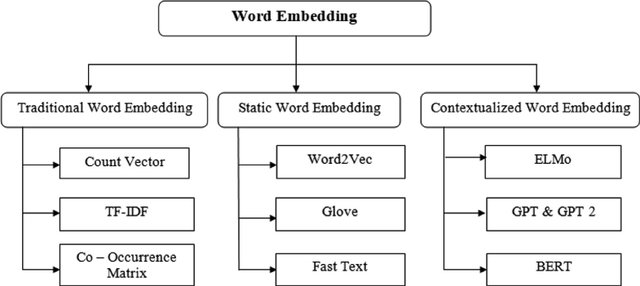

# Embedding

Word embedding is a technique of representing individual words as a vector of numerical vectors in a predefined vector space. Each word is mapped to a vector and the vector representations for words having same meaning are similar.

*[[Image Source]](https://www.researchgate.net/publication/361134482_A_Survey_on_Sentence_Embedding_Models_Performance_for_Patent_Analysis/figures?lo=1)*

## Methods Included

- [x] [Bag of Words](https://github.com/arunism/NLP-Fundamentals/blob/master/02-Embedding/01-BoW.ipynb)
- [x] [TF-IDF](https://github.com/arunism/NLP-Fundamentals/blob/master/02-Embedding/02-TFIDF.ipynb)
- [x] [Co-occurrence Matrix](https://github.com/arunism/NLP-Fundamentals/blob/master/02-Embedding/03-Cooccurance-Matrix.ipynb)
- [x] [Word2Vec](https://github.com/arunism/NLP-Fundamentals/blob/master/02-Embedding/04-Word2Vec.ipynb)
- [x] [Glove](https://github.com/arunism/NLP-Fundamentals/blob/master/02-Embedding/05-Glove.ipynb)

## References

1. [A Survey on Sentence Embedding Models Performance for Patent Analysis](https://arxiv.org/abs/2206.02690)
2. [Apply a Simple Bag-of-Words Approach](https://openclassrooms.com/en/courses/6532301-introduction-to-natural-language-processing/6980811-apply-a-simple-bag-of-words-approach)
3. [Quick Introduction to Bag-of-Words and TF-IDF](https://www.analyticsvidhya.com/blog/2020/02/quick-introduction-bag-of-words-bow-tf-idf/)
4. [Co-occurrence matrix](https://en.wikipedia.org/wiki/Co-occurrence_matrix)
5. [Distributional Semantics | Co-Occurrence Matrix](https://medium.com/@imamitsehgal/nlp-series-distributional-semantics-co-occurrence-matrix-31283629951e)
6. [Word Vectors Intuition and Co-Occurrence Matrices](https://towardsdatascience.com/word-vectors-intuition-and-co-occurence-matrixes-a7f67cae16cd)
7. [Distributed Representations of Words and Phrases and their Compositionality](https://arxiv.org/pdf/1310.4546.pdf)
8. [Word2Vec Neural Network from scratch](https://towardsdatascience.com/skip-gram-neural-network-from-scratch-485f2e688238)
9. [Word2Vec Parameter Learning Explained](https://arxiv.org/pdf/1411.2738.pdf)
10. [Stack Overflow Semantic Search](https://medium.com/@shekharsingh441991/stack-overflow-semantic-search-4fd1df286cee)
11. [NLP — Word Embedding & GloVe](https://jonathan-hui.medium.com/nlp-word-embedding-glove-5e7f523999f6)
12. [GloVe: Global Vectors for Word Representation](https://nlp.stanford.edu/pubs/glove.pdf)
13. [Intuitive Guide to Understanding GloVe Embeddings](https://towardsdatascience.com/light-on-math-ml-intuitive-guide-to-understanding-glove-embeddings-b13b4f19c010)
14. [Getting started with NLP: Word Embeddings, GloVe and Text classification](https://edumunozsala.github.io/BlogEms/jupyter/nlp/classification/embeddings/python/2020/08/15/Intro_NLP_WordEmbeddings_Classification.html)
