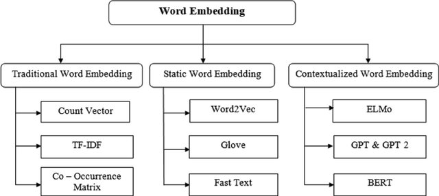
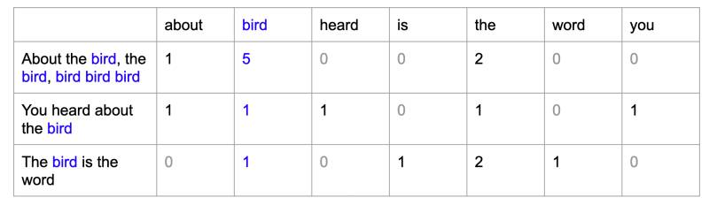
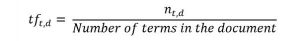
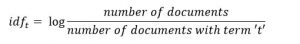
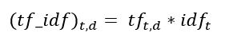
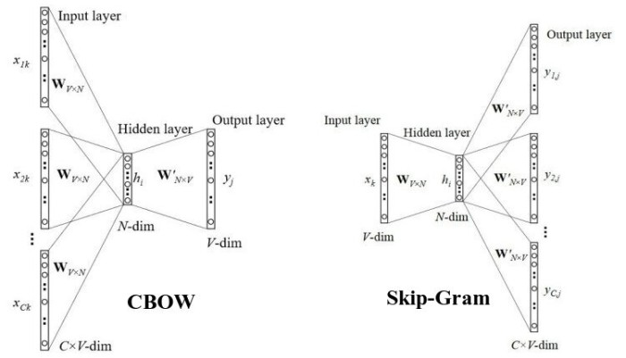
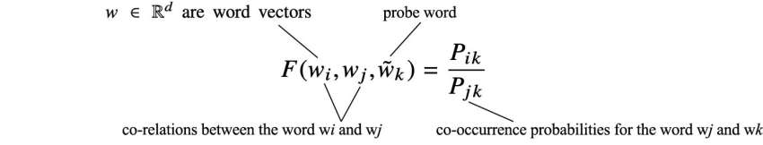

# Embedding

Word embedding is a technique of representing individual words as a vector of numerical vectors in a predefined
vector space. Each word is mapped to a vector and the vector representations for words having same meaning are
similar.

     
    <a href="https://www.researchgate.net/publication/361134482_A_Survey_on_Sentence_Embedding_Models_Performance_for_Patent_Analysis/figures?lo=1"><i>[Image Source]</i></a>

- ### [Bag of Words](https://github.com/arunism/NLP-Fundamentals/blob/master/Embedding/bow.ipynb)

    Bag of Words is the simplest form of word embedding. Bag of words models encode every word in the vocabulary
    as one-hot-encoded vector. The process for Bag of Words goes through the following steps:
    1. Construct a vocabulary of words.
    2. Construct a vector of dimension *d* (*d* being the vocabulary size). Each index/dimension of the vector
       corresponds to a unique word in the vocabulary. The value in each shell of the vector represents the number
       of times the word with that index occurs in the corpus.
    
    **Drawbacks of Bag-of-Words:**
    - Vector length is insanely large for large corpus.
    - BoW results to sparse matrix, which is what we would like to avoid.
    - Retains no information about grammar and ordering of words in a corpus.

    

       
    

- ### [TF-IDF](https://github.com/arunism/NLP-Fundamentals/blob/master/Embedding/bow.ipynb)

    In NLP an independent text entity is known as document and the collection of all these documents over the
    project space is known as corpus. TF-IDF stands for Term Frequency-Inverse Document Frequency.
    The entire technique can be studied by studying _TF_ and _IDF_ separately.

    _Term-Frequency_ is a measure of frequency of appearance of term *t* in a document *d*. In other words,
    the probability of finding term *t* in a document *d*. `Mathematically:`

    

       
    

    *Inverse-Document-Frequency* is a measure of inverse of probability of finding a document that contains term _t_
    in a corpus. In other words, a measure of the importance of term _t_. `Mathematically:`

    

       
    

    We can now compute the TF-IDF score for each word in the corpus. Words with a higher score are more important. 
    TF-IDF score is high when both IDF and TF values are high. So, TF-IDF gives more importance to words that are:
    1. More frequent in the entire corpus
    2. Rare in the corpus but frequent in the document.

    Now this TF-IDF score is used as a value for each shell of the document-term matrix, just like the frequency of
    words in case of Bag-of-Words. The formula below is used to compute TF-IDF score for each shell:

    

       
    

- ### [Co-occurrence Matrix]()

    Generally speaking, a co-occurrence matrix will have specific entities in rows (ER) and columns (EC).
    The purpose of this matrix is to present the number of times each ER appears in the same context as each EC.
    As a consequence, in order to use a co-occurrence matrix, you have to define your entites and the context
    in which they co-occur.

    In NLP, the most classic approach is to define each entity (ie, lines and columns) as a word present in a text,
    and the context as a sentence.

    *Consider the following text:*
    > Roses are red. Sky is blue.

    With the classic approach described before, we'll have the following matrix:

              |  Roses | are | red | Sky | is | blue
        Roses |    1   |  1  |  1  |  0  |  0 |   0
        are   |    1   |  1  |  1  |  0  |  0 |   0
        red   |    1   |  1  |  1  |  0  |  0 |   0
        Sky   |    0   |  0  |  0  |  1  |  1 |   1
        is    |    0   |  0  |  0  |  1  |  1 |   1
        Blue  |    0   |  0  |  0  |  1  |  1 |   1

    Here, each cell indicates wether the two items co-occur or not. You may replace it with the number of times
    it appears, or with a more sophisticated approach. You may also change the entities themselves, by putting
    nouns in columns and adjective in lines instead of every word.

    `What are they used for in NLP?` The most evident use of these matrix is their ability to provide links
    between notions. Let's suppose you're working on products reviews. Let's also suppose for simplicity that
    each review is only composed of short sentences. You'll have something like that:

    > Product X is amazing. I hate product Y.

    Representing these reviews as one co-occurrence matrix will enable you associate products with appreciations.
     *[[Source]](https://stackoverflow.com/questions/24073030/what-are-co-occurence-matrixes-and-how-are-they-used-in-nlp)*

- ### [Word2Vec](https://github.com/arunism/NLP-Fundamentals/blob/master/Embedding/w2v.ipynb)

    Word2Vec deals with two different types of words to generate embedding vectors. The word we are looking into
    is the *Focus Word* and the words surrounding it are the *Context Words*. Word2Vec can be achieved using
    two methods: Skip-Gram and Common-Bag-of-Words (CBOW).

    `CBOW Model:` The core idea of CBOW is: Given a context word, can we predict the focus word?
    Let's understand the working of CBOW:
    1. Construct a vocabulary of size _v_.
    2. Represent each word using one-hot-encoding. So, each word corresponds to a *v*-dimensional binary vector.
    3. Pass v-dimensional context vectors as input to a neural network with N-dimensional hidden layer and generate
       an output vector again of v-dimensions.

    `Skip-Gram Model:` In skip-gram the behaviour gets flipped i.e. it predicts context words given the focus word.
    In both CBOW and skip-gram we have *k+1* numbers of *NxV* sized vectors. But CBOW has only 1 softmax to train while
    skip-gram has k softmax to train. So, it is obvious that skip-gram takes more time to train.

    In both cases the neurons of hidden layer consists of _linear_ activation function while the output layer is
    associated with *softmax* activation function. All the neurons are fully connected. It has been experienced that
    skip-gram works well with small amount of data and is found to represent rare words well while CBOW is faster
    and has better representations for more frequent words.

    

       
    

- ### [Glove](https://github.com/arunism/NLP-Fundamentals/blob/master/Embedding/glove.ipynb)

    GloVe stands for Global Vectors for word representation and was developed by researchers at Stanford University.
    It is unsupervised learning algorithm aiming to generate word embeddings by aggregating global word co-occurrence
    matrices from a given corpus. To start with GloVe, first we have to download the pre-trained model hosted
    *[here](https://nlp.stanford.edu/projects/glove/)*. A total of four pre-trained models are available there. Get your own choice.

    The basic idea behind the GloVe word embedding is to derive the relationship between the words from statistics.
    
    

         
    

## References

1. [A Survey on Sentence Embedding Models Performance for Patent Analysis](https://arxiv.org/abs/2206.02690)
2. [Apply a Simple Bag-of-Words Approach](https://openclassrooms.com/en/courses/6532301-introduction-to-natural-language-processing/6980811-apply-a-simple-bag-of-words-approach)
3. [Quick Introduction to Bag-of-Words and TF-IDF](https://www.analyticsvidhya.com/blog/2020/02/quick-introduction-bag-of-words-bow-tf-idf/)
4. [Co-occurrence matrix](https://en.wikipedia.org/wiki/Co-occurrence_matrix)
5. [Distributional Semantics | Co-Occurrence Matrix](https://medium.com/@imamitsehgal/nlp-series-distributional-semantics-co-occurrence-matrix-31283629951e)
6. [Word Vectors Intuition and Co-Occurrence Matrices](https://towardsdatascience.com/word-vectors-intuition-and-co-occurence-matrixes-a7f67cae16cd)
7. [Distributed Representations of Words and Phrases and their Compositionality](https://arxiv.org/pdf/1310.4546.pdf)
8. [Word2Vec Neural Network from scratch](https://towardsdatascience.com/skip-gram-neural-network-from-scratch-485f2e688238)
9. [Word2Vec Parameter Learning Explained](https://arxiv.org/pdf/1411.2738.pdf)
10. [Stack Overflow Semantic Search](https://medium.com/@shekharsingh441991/stack-overflow-semantic-search-4fd1df286cee)
11. [NLP — Word Embedding & GloVe](https://jonathan-hui.medium.com/nlp-word-embedding-glove-5e7f523999f6)
12. [GloVe: Global Vectors for Word Representation](https://nlp.stanford.edu/pubs/glove.pdf)
13. [Intuitive Guide to Understanding GloVe Embeddings](https://towardsdatascience.com/light-on-math-ml-intuitive-guide-to-understanding-glove-embeddings-b13b4f19c010)
