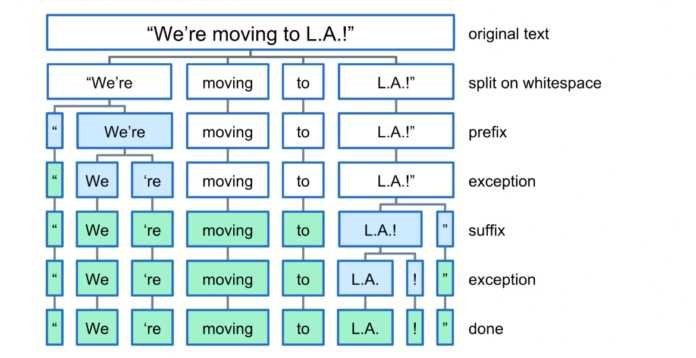

# Tokenization

Tokenization is one of the first steps in NLP pipeline.
It is a technique to split a sentence, phrase, paragraph or an entire document to smaller units.
These smaller units are called tokens. Tokens must not always be words. They can be either
symbols and letters (., !, a, z, ...) or sentences or any other forms of text.

> The program works well with python version >=3.8.0.
> Make sure the requirements mentioned here are satisfied,
> or the result may not be as expected.

## Methods Included

- [NLTK](https://github.com/arunism/NLP-Fundamentals/blob/master/Tokenization/nltk.ipynb)
    
    This module is used for statistical natural language processing. It consists of module called `tokenize`
    with several methods that aids in splitting text to tokens like: `word_tokenize`, `sent_tokenize`,
    `wordpunct_tokenize`, `WhitespaceTokenizer`.

    

         
        <a href="https://udemy.com/course/python-for-data-science-and-machine-learning-bootcamp"><i>Image source</i><a/>
    

- [Spacy](https://github.com/arunism/NLP-Fundamentals/blob/master/Tokenization/spacy.ipynb)
    
    In Spacy, the process of tokenizing a text into segments of words and punctuation is done in various steps.
    It processes the text from left to right.

    - First, the tokenizer split the text on whitespace similar to the split() function.
    - Then the tokenizer checks whether the substring matches the tokenizer exception rules. For example,
      “don’t” does not contain whitespace, but should be split into two tokens, “do” and “n’t”, while “U.K.”
      should always remain one token.
    - Next, it checks for a prefix, suffix, or infix in a substring, these include commas, periods, hyphens, or quotes.
      If it matches, the substring is split into two tokens.

    

       
      <a href="https://machinelearningknowledge.ai/complete-guide-to-spacy-tokenizer-with-examples/"><i>Source</i><a/>
    

- [TorchText](https://github.com/arunism/NLP-Fundamentals/blob/master/Tokenization/torchtext.ipynb)
    
    Torchtext is a PyTorch based library. Pytorch is an open source machine learning framework developed by
    [Facebook](https://github.com/facebook). Torchtext is a collection of data processing utilities for text data and
    popular datasets for natural language processing. If you are working with PyTorch on an NLP task than TorchText
    would be one of the best things to check out.

    TorchText facilitates tokenization using get_tokenizer() method. `get_tokenizer(tokenizer, language='en')`
    generates a tokenizer function which in turn converts a string to its corresponding tokens. The `tokenizer`
    argument can be either a callable function or a library (basic_english, spacy, subword, moses, toktok, revtok).

- [TensorFlow Tokenizer](https://github.com/arunism/NLP-Fundamentals/blob/master/Tokenization/tensorflow.ipynb)
    
    Tensorflow is a free and open source library developed by [Google](https://github.com/google) for training
    and inference of deep neural networks. In this repo, we shall use Keras API with the tensorflow backend.
    Keras tokenizer focuses primarily on two methods:

  - `fit_on_texts:` Updates internal vocabulary based on a list of texts. This method creates the vocabulary index
    based on word frequency. So if you give it something like, "The cat sat on the mat." It will create a dictionary
    s.t. word_index["the"] = 1; word_index["cat"] = 2 it is word -> index dictionary so every word gets a unique
    integer value. 0 is reserved for padding. So lower integer means more frequent word (often the first few are
    stop words because they appear a lot).

  - `texts_to_sequences:` Transforms each text in texts to a sequence of integers. So it basically takes each word
    in the text and replaces it with its corresponding integer value from the word_index dictionary. Nothing more,
    nothing less, certainly no magic involved.

Why don't combine them? Because you almost always fit once and convert to sequences many times. You will fit on
your training corpus once and use that exact same word_index dictionary at train / eval / testing / prediction time
to convert actual text into sequences to feed them to the network. So it makes sense to keep those methods separate.

## References

1. [NLTK Tokenizer Package Documentation](https://www.nltk.org/api/nltk.tokenize.html)
2. [NLTK Tokenize – Complete Tutorial for Beginners](https://machinelearningknowledge.ai/nltk-tokenizer-tutorial-with-word_tokenize-sent_tokenize-whitespacetokenizer-wordpuncttokenizer/)
3. [Python for Data Science and Machine Learning Bootcamp](https://www.udemy.com/course/python-for-data-science-and-machine-learning-bootcamp/)
4. [Spacy Tokenization Documentation](https://spacy.io/usage/linguistic-features#tokenization)
5. [Complete Guide to Spacy Tokenizer with Examples](https://machinelearningknowledge.ai/complete-guide-to-spacy-tokenizer-with-examples/)
6. [TorchText Tokenizer Documentation](https://pytorch.org/text/stable/data_utils.html)
7. [Tokenizing with TF Text](https://www.tensorflow.org/text/guide/tokenizers)
8. [What does Keras Tokenizer method exactly do?](https://stackoverflow.com/questions/51956000/what-does-keras-tokenizer-method-exactly-do)
9. [Guide to Subword Tokenizers by Tensorflow](https://www.tensorflow.org/text/guide/subwords_tokenizer)
