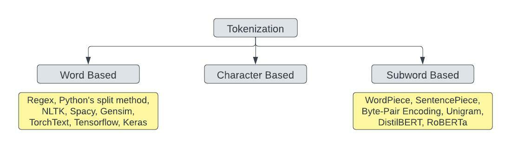
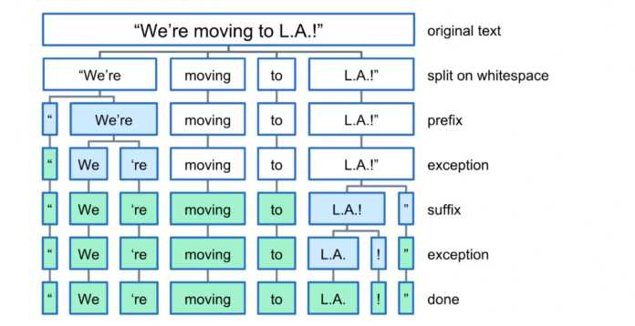
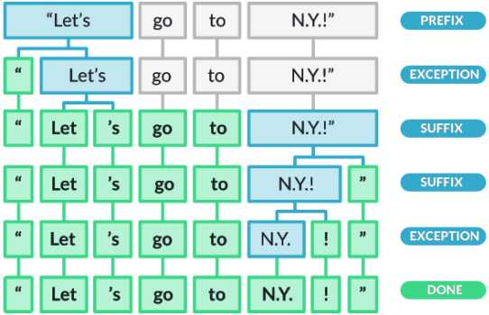
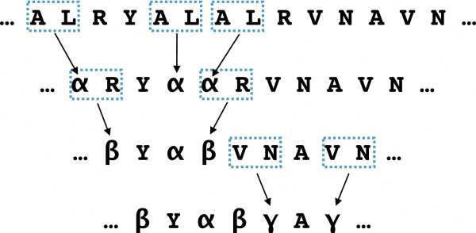

# Tokenization

Tokenization is one of the first steps in NLP pipeline.
It is a technique to split a sentence, phrase, paragraph or an entire document to smaller units.
These smaller units are called tokens. Tokens must not always be words. It can be anything — 
a word, a subword, or a character.

     

As illustrated in the figure above, tokenization is primarily categorised to three different groups.
A `word-based` tokenization algorithm will break a text into words based on a delimiter. This technique leads
to massive vocabulary size and large number of OOV tokens. This leads to heavier model and loss of information
as the model will not learn anything about the OOV words. `Character-based` tokenizers split the raw text into
individual characters. This results in a very small vocabulary and no or very few OOV tokens. The space and time
complexity is reduced. Yet this technique is not considered the best because it results in very long sequences and
a character does not carry useful meaning as a word does. A solution between these two techniques is `subword-based`
tokenization. The subword splitting will help the model learn that the words with the same root word as “token” like
“tokens” and “tokenizing” are similar in meaning. Subword-based tokenization algorithms uses the following principles:

- Do not split the frequently used words into smaller subwords.
- Split the rare words into smaller meaningful subwords.

## Methods Included

- ### [NLTK](https://github.com/arunism/NLP-Fundamentals/blob/master/Tokenization/nltk.ipynb)
    
    This module is used for statistical natural language processing. It consists of module called `tokenize`
    with several methods that aids in splitting text to tokens like: `word_tokenize`, `sent_tokenize`,
    `wordpunct_tokenize`, `WhitespaceTokenizer`.

    

         
        <a href="https://udemy.com/course/python-for-data-science-and-machine-learning-bootcamp"><i>[Image source]</i><a/>
    

- ### [Spacy](https://github.com/arunism/NLP-Fundamentals/blob/master/Tokenization/spacy.ipynb)
    
    In Spacy, the process of tokenizing a text into segments of words and punctuation is done in various steps.
    It processes the text from left to right.

    - First, the tokenizer split the text on whitespace similar to the split() function.
    - Then the tokenizer checks whether the substring matches the tokenizer exception rules. For example,
      “don’t” does not contain whitespace, but should be split into two tokens, “do” and “n’t”, while “U.K.”
      should always remain one token.
    - Next, it checks for a prefix, suffix, or infix in a substring, these include commas, periods, hyphens, or quotes.
      If it matches, the substring is split into two tokens.

    

       
      <a href="https://machinelearningknowledge.ai/complete-guide-to-spacy-tokenizer-with-examples/"><i>[Source]</i><a/>
    

- ### [TorchText](https://github.com/arunism/NLP-Fundamentals/blob/master/Tokenization/torchtext.ipynb)
    
    Torchtext is a PyTorch based library. Pytorch is an open source machine learning framework developed by
    [Facebook](https://github.com/facebook). Torchtext is a collection of data processing utilities for text data and
    popular datasets for natural language processing. If you are working with PyTorch on an NLP task than TorchText
    would be one of the best things to check out.

    TorchText facilitates tokenization using get_tokenizer() method. `get_tokenizer(tokenizer, language='en')`
    generates a tokenizer function which in turn converts a string to its corresponding tokens. The `tokenizer`
    argument can be either a callable function or a library (basic_english, spacy, subword, moses, toktok, revtok).

- ### [TensorFlow Tokenizer](https://github.com/arunism/NLP-Fundamentals/blob/master/Tokenization/tensorflow.ipynb)
    
    Tensorflow is a free and open source library developed by [Google](https://github.com/google) for training
    and inference of deep neural networks. In this repo, we shall use Keras API with the tensorflow backend.
    Keras tokenizer focuses primarily on two methods:

    - `fit_on_texts:` Updates internal vocabulary based on a list of texts. This method creates the vocabulary index
      based on word frequency. So if you give it something like, "The cat sat on the mat." It will create a dictionary
      s.t. word_index["the"] = 1; word_index["cat"] = 2 it is word -> index dictionary so every word gets a unique
      integer value. 0 is reserved for padding. So lower integer means more frequent word (often the first few are
      stop words because they appear a lot).

    - `texts_to_sequences:` Transforms each text in texts to a sequence of integers. So it basically takes each word
      in the text and replaces it with its corresponding integer value from the word_index dictionary. Nothing more,
      nothing less, certainly no magic involved.

    Why don't combine them? Because you almost always fit once and convert to sequences many times. You will fit on
    your training corpus once and use that exact same word_index dictionary at train / eval / testing / prediction time
    to convert actual text into sequences to feed them to the network. So it makes sense to keep those methods separate.

- ### [Byte-Pair Encoding](https://github.com/arunism/NLP-Fundamentals/blob/master/Tokenization/bpe.ipynb)
    
    Byte-Pair Encoding, is a data compression algorithm that iteratively replaces the most frequent pair of bytes 
    in a sequence with a single, unused byte.

    `For example:` Let 'aaabdaaabac' be the string. Here 'aa' is the most frequent pair of bytes, so we replace it
    with some unused byte, let's say 'Z'. Now the string becomes 'ZabdZabac'. 'ab' is now the most frequent pair,
    we replace it with 'Y' and get 'ZYdZYac'. After the latest update the most frequent pair be 'ZY'. Replace it with
    'X' so the obtained string be 'XdXac'.

    To adapt this idea for word segmentation, instead of replacing frequent pair of bytes, we now merge
    subword pairs that frequently occur. Let's elaborate it stepwise:

    - We initialize the vocabulary representing each word as a sequence of characters, plus a special end-of-word
      symbol '/w', which allows us to restore the original tokenization after translation. More on this below.
    - Next, we iteratively count all symbol pairs and merge each occurrence of the most frequent pair (a, b) into ab.
      Each merge operation produces a new symbol which represents a character n-gram.
    - We'll keep repeating the previous process until the target vocabulary size is reached.

    Why is end of word symbol '/w' important? Let's say there is a token 'est'. Both the words 'eastern' and 'smallest'
    contain the subword 'est'. However, meanings of the subword between the two are quite different. With the
    end of word symbol, if there is a token est/w, the model immediately interprets the subword represents the
    terminating meaning of the word.

    

       
      <a href="https://www.computer.org/csdl/journal/tb/2020/05/08678449/1nJsrGwiJqg"><i>[Image Source]</i><a/>
    

- ### [WordPiece Tokenization](https://github.com/arunism/NLP-Fundamentals/blob/master/Tokenization/wordpiece.ipynb)
    
    WordPiece and BPE are two similar and commonly used techniques to segment words into subword-level in NLP tasks.
    In both cases, the vocabulary is initialized with all the individual characters in the language, and then the
    most frequent/likely combinations of the symbols in the vocabulary are iteratively added to the vocabulary.
    The WordPiece algorithm can be processed as:

    1. Initialize the word unit inventory with all the characters in the text.
    2. Build a language model on the training data using the inventory from 1.
    3. Generate a new word unit by combining two units out of the current word inventory to increment the word unit
       inventory by one. Choose the new word unit out of all the possible ones that increases the likelihood on the
       training data the most when added to the model.
    4. Goto step 2 until a predefined limit of word units is reached or the likelihood increase falls below a
       certain threshold.

    WordPiece and BPE are two similar and commonly used techniques to segment words into subword-level in NLP tasks.
    In both cases, the vocabulary is initialized with all the individual characters in the language, and then the
    most frequent/likely combinations of the symbols in the vocabulary are iteratively added to the vocabulary.

    `For Example:` 
    *Input Text:* she walked . he is a dog walker . i walk  
    *First 3 BPE Merges:*
    1. w a = wa
    2. l k = lk
    3. wa lk = walk

    So at this stage, your vocabulary includes all the initial characters, along with wa, lk, and walk.
    You usually do this for a fixed number of merge operations.

    `How does it handle rare/OOV words?` Quite simply, OOV words are impossible if you use such a segmentation method.
    Any word which does not occur in the vocabulary will be broken down into subword units. Similarly, for rare words,
    given that the number of subword merges we used is limited, the word will not occur in the vocabulary, so it will
    be split into more frequent subwords.

    `How does this help?` Imagine that the model sees the word walking. Unless this word occurs at least a few times
    in the training corpus, the model can't learn to deal with this word very well. However, it may have the words
    walked, walker, walks, each occurring only a few times. Without subword segmentation, all these words are
    treated as completely different words by the model. However, if these get segmented as walk@@ ing, walk@@ ed,
    etc., notice that all of them will now have walk@@ in common, which will occur much frequently while training,
    and the model might be able to learn more about it.
     
    *[[Source]](https://stackoverflow.com/questions/55382596/how-is-wordpiece-tokenization-helpful-to-effectively-deal-with-rare-words-proble/55416944#55416944)*

## References

1. [Tokenization doesn't have to be slow !](https://notebook.community/huggingface/pytorch-transformers/notebooks/01-training-tokenizers)
2. [NLTK Tokenizer Package Documentation](https://www.nltk.org/api/nltk.tokenize.html)
3. [NLTK Tokenize – Complete Tutorial for Beginners](https://machinelearningknowledge.ai/nltk-tokenizer-tutorial-with-word_tokenize-sent_tokenize-whitespacetokenizer-wordpuncttokenizer/)
4. [Python for Data Science and Machine Learning Bootcamp](https://www.udemy.com/course/python-for-data-science-and-machine-learning-bootcamp/)
5. [Spacy Tokenization Documentation](https://spacy.io/usage/linguistic-features#tokenization)
6. [Complete Guide to Spacy Tokenizer with Examples](https://machinelearningknowledge.ai/complete-guide-to-spacy-tokenizer-with-examples/)
7. [TorchText Tokenizer Documentation](https://pytorch.org/text/stable/data_utils.html)
8. [Tokenizing with TF Text](https://www.tensorflow.org/text/guide/tokenizers)
9. [What does Keras Tokenizer method exactly do?](https://stackoverflow.com/questions/51956000/what-does-keras-tokenizer-method-exactly-do)
10. [Guide to Subword Tokenizers by Tensorflow](https://www.tensorflow.org/text/guide/subwords_tokenizer)
11. [Word, Subword, and Character-Based Tokenization: Know the Difference](https://towardsdatascience.com/word-subword-and-character-based-tokenization-know-the-difference-ea0976b64e17)
12. [Google Sentencepiece : Unsupervised Text Tokenizer](https://github.com/google/sentencepiece)
13. [A New Algorithm for Data Compression](https://www.derczynski.com/papers/archive/BPE_Gage.pdf)
14. [Byte-Pair Encoding Tokenization](https://huggingface.co/course/chapter6/5)
15. [Byte-Pair Encoding Algorithm](https://leimao.github.io/blog/Byte-Pair-Encoding/)
16. [Tokenizers: How Machines Read](https://blog.floydhub.com/tokenization-nlp/)
17. [WordPiece Tokenization](https://huggingface.co/course/chapter6/6)
18. [A Fast WordPiece Tokenization System](https://ai.googleblog.com/2021/12/a-fast-wordpiece-tokenization-system.html)
19. [Google's Neural Machine Translation System: Bridging the Gap between Human and Machine Translation](https://arxiv.org/abs/1609.08144v2)
